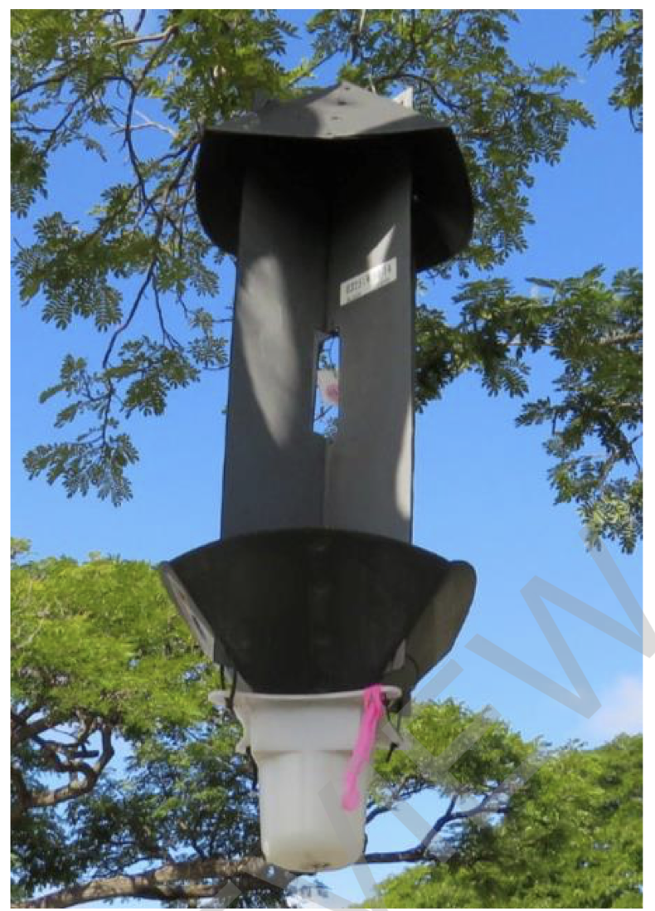

## CRB Detection and Prediction (Ongoing Project)

This repository hosts an ongoing effort to organize Coconut Rhinoceros Beetle (CRB) trap imagery, explore trends, and build lightweight machine-learning based predictions. The work here continues and builds on earlier contributions associated with Dr. Paryavi. You can find his related materials at:

- GitHub: [Paryavi/CRBDetector](https://github.com/Paryavi/CRBDetector)
- Google Scholar: [CRB-related publication](https://scholar.google.com/citations?view_op=view_citation&hl=en&user=a_62yLUAAAAJ&sortby=pubdate&citation_for_view=a_62yLUAAAAJ:WF5omc3nYNoC)

### What is CRB and why this matters

The Coconut Rhinoceros Beetle (CRB, Oryctes rhinoceros) is an invasive pest that damages palms by boring into the crowns to feed on sap. This can stunt growth, cause the characteristic “V” cuts in fronds, and—in severe cases—kill trees. CRB pressure impacts agriculture, urban landscapes, and native ecosystems, making early detection and response a priority across the Hawaiian Islands.

Local programs deploy traps and field monitoring to track activity. Images captured from traps provide valuable situational awareness—how often beetles are present, when activity peaks, and where the hotspots may be. Turning these images into accessible daily views and simple forecasts helps partners and the community see what’s happening now and prepare for what may come next.

### What this project provides

- A simple web interface for browsing daily trap images (e.g., Oahu today/yesterday) and a growing collection for other islands
- A consolidated “All Pages” list for quick navigation
- Initial, non-invasive machine learning analysis to summarize activity trends and produce daily “prediction today” views
- A foundation for map-based and island-specific pages sourced from the same image data

> Scope note: This repository does not cover the electronics/circuitry work found in earlier efforts. The focus here is on image organization, data exploration, and ML-based predictions.

### Example trap image

### Status

Active development. Interfaces and data views may change as we refine the workflow and improve prediction quality. Feedback from field teams and stakeholders is welcome.

### Acknowledgment

This project builds on the groundwork and prior materials associated with Dr. Paryavi. See the linked resources above and the included dissertation in `Publication/pyrovi_dissertation.pdf` for additional background context. We appreciate the community and agency partners contributing trap data and field insights.

### Using this repository

If you are running the app locally, you can start the server with your usual Flask workflow and navigate to the daily pages (e.g., Oahu Today, Oahu Yesterday) and the “All Pages” listing. The codebase includes a minimal setup to render images stored under `app/static/` and a page for viewing daily predictions when available.

### License

MIT License. See `LICENSE` for details.